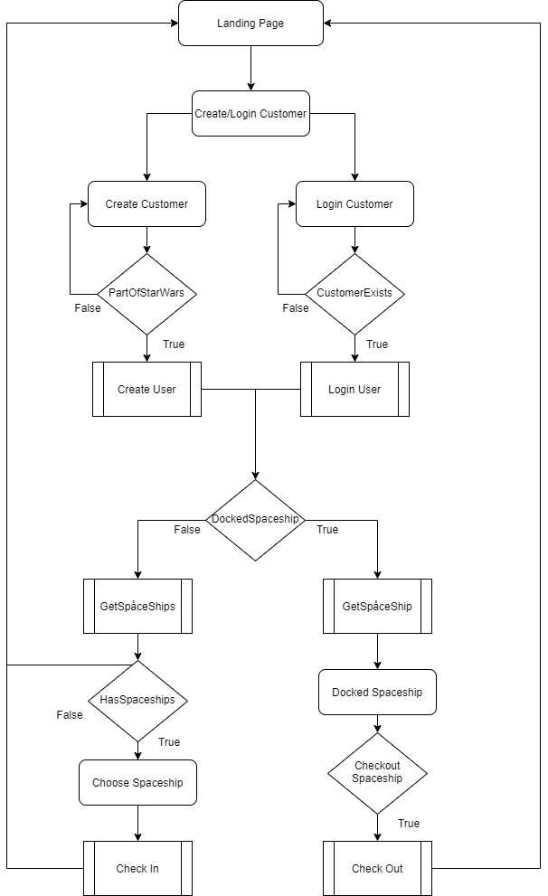
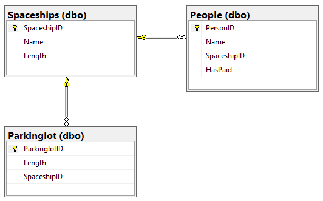

# Introduktion

The Spaceport är en rymdskeppsparkering för Star Wars universumet med en separat frontend och backend. Personerna som får parkera måste vara en del av Star Wars. Syftet med projektet var att vi skulle lära oss hur följande resurser mångd olika resurser i Azure kan fungera sammankopplat:

## Arbetssätt

Vi bestämde några förhållningsregler för hur projektet skulle fungera.

* Arbetstider 09:30 - 16:30 varje dag
* För blogg så mycket som möjligt
* Dela upp arbete i den mån möjligt
* Sitta mycket med Azure tillsammans

## Azure DevOps

Vi använde oss utav Azure DevOps-Boards för att planera upp projektet och lägga till Tasks på det vi behövde göra, vilket vi använde flitigt till en början men blev sämre på att använda under projektets gång. 

Tanken var att vi skulle använda oss utav sprintar och få till en bra planering runt detta, men det blev ändå mer att vi strukturerade om planeringen och använde oss utav bloggar istället.

# Planering

I början av projektet diskuterade vi och kom fram till att vi skulle använda ett projekt ifrån den tidigare kursen, eftersom att koden inte var i fokus i detta projekt så kunde vi spara tid. Vi visste även i ett tidigt skede att vi kommer behöva arbeta med många olika benämningar så vi valde att göra ett dokument för [namngivelser](Namngivelsekonvention.md), så att vi alla lättare kunde hålla koll på vad alla olika resurserna skulle ha för namn. Vi diskuterade lite kring hur vi skulle lägga upp vår *Frontend* och eftersom ingen av oss direkt hade kodat i *Razor Pages*  innan så tänkte vi att detta skulle va ett bra tillfälle att lära sig detta, så vi bestämde att vi skulle köra på det för våran *Frontend*. Tanken var att vi skulle få våran *Frontend* och *API* att köra mot varanda och att det skulle vara möjligt att göra en *Post* till *API*.

## Azure

Vi såg till att lägga upp vissa resurser i *Azure* i ett väldigt tidigt stadie, så som *Resource Group* och *SQL Server* och *SQL Databas* för att kunna arbeta efter en utvecklingsmiljö uppe i molnet så tidigt som möjligt och därefter utöka det till att inkludera en produktionsmiljö också. När det var fixat såg vi till att ge *Azure DevOps*-projektet tillgång till den *Resource Group* vi skapat.


### Continuous Integration Pipeline(CI)

Vi såg till att lägga upp en pipeline i ett väldigt tidigt stadie där tanken var att det kontinuerligt skulle byggas nya images till *Azure Container Registry*. Här kan du läsa mer om  [Continuous Integration](Dokumentation/CI%20Pipeline.md).

### Continuous Delivery Pipeline(CD)

Till en början hade vi inte riktigt någon koll på hur vi skulle vilja distribuera produkten, men vi hade en tanke på att leverera denna till en *Azure Container Instance* utifrån *Azure Container Registry*. Vi hade tankar på att först leverera till en utvecklingsmiljö för att sedan vidare till en produktionsmiljö. Här kan du läsa mer om [Continuous Delivery](Dokumentation/CD%20Pipeline.md).

### Docker

Eftersom att vi skulle ha vår *Frontend* separerad ifrån våran *API* så visste vi att vi skulle behöva två olika images, som skulle laddas upp i två olika resurser på Azure. Till en början bestämde vi att vi skulle försöka att få våran API att fungera i våran *CI Pipeline*. 

**Vår Dockerfil-konfiguration:**

```yaml
FROM mcr.microsoft.com/dotnet/core/sdk:3.1 AS build-env
WORKDIR /app

# Copy csproj and restore as distinct layers
COPY ./SpacePark/SpacePark/*.csproj ./
RUN dotnet restore

# Copy everything else and build
COPY ./SpacePark/SpacePark/ ./
RUN dotnet publish -c Release -o out

# Build runtime image
FROM mcr.microsoft.com/dotnet/core/aspnet:3.1
WORKDIR /app
COPY --from=build-env /app/out .
ENTRYPOINT ["dotnet", "SpacePark.dll"]
```

# Frontend

Vi diskuterade kring hur vi skulle skapa våran *Frontend* och funderade på att skapa en *Web App* projekt med *ModelViewController* eller *Razor Pages*, det blev att vi valde att göra med *Razor Pages*, med tanken på att det skulle gå relativt smidigt och enkelt att få upp en presentation.

Nedan visar vi ett diagram som visar på flödet i våran applikation:

 

# API

Vår *API* är ett .NET-core *API*. Vi ville få till databasen snabbt så att vi kunde testa vårt *API*, så vi konfigurerade en databas och körde igång den i *Azure* så att alla kunde testa emot samma databas. 

## SQL Databas

Vi valde att använda oss av en serverless SQL-Databas då vi kände att det var det självklara valet i och med att vi ville ha en stabil relations-databas till projektet. Vi valde serverless för att vi inte skulle ha mycket trafik och av den rent ekonomiska anledningen att det är billigare för våra syften. 

**Våran databas-struktur i SQL:**

​          

# Resultat 

Här är flödet över hela flödet CI/CD pipeline som den ser ut just nu.

 


## Priser

Du kan läsa mer om priser och vad saker och ting på Azure kostar [här](Priser.md).

## Problem och lösningar

### RazorPages

Vi antog oss utmaningen att bygga vår frontend med RazorPages, dels för att defaultsidan som kom med när vi skapade projektet var uppbyggt med RazorPages men också för att lära oss något nytt sätt att hantera frontend.  Detta beslut gjorde att byggandet av vår frontend tog längre tid än som vad tänkt. Dels på grund utav att vi var tvungna att hantera flera sidor och passa runt de värden som våra modeller innehåll från sida till sida för att kunna hantera parkering av skepp och checka ut skepp. Detta skulle visa sig vara med komplicerat än vad vi hade räknat med, då bland annat RazorPages inte kan hantera komplexa objekt.

Vi är väl inte helt nöjda med hur koden till vår frontend är uppbyggd, för att spara tid och få till mer "clean code" hade det varit bättre att vi skulle hålla oss till vanlig HTML och JavaScript-kodning som vi är mer bekväma med redan från start, men då vi hade kommit en bit på vår RazorPages lösning fanns det inte utrymme för att ändra på arbetssättet.

Sammanfattningsvis kan man säga att vi är nöjda med att få till alla funktioner med RazorPages men vi är inte nöjda med hur det ser ut i koden.

**Azure KeyVault**

Vår KeyVault-lösning var också en del i projektet som tog mer tid än väntat, dels på grund utav vår egna bristfällighet i kunskap om just KeyVault men också att vi hittade väldigt många olika lösningar på internet som var kvalitetsvarierande i deras dokumentation. Vi testade väldigt många olika lösningsexempel som vi hittade på internet men inget fungerade och vi var väldigt nära på att slopa idéen om att använda oss utav KeyVault för att bevara vår "connectionsstring". Som tur var fick vi lite hjälpa från Grupp 1 på hur dom hade löst det i kod, då vi kombinerade en del utav deras lösning med ett lösningsexempel på internet fick vi det att fungera.

Att vi löste kopplingen mellan vårt API och vår Key Vault är vi såklart nöjda med men på andra sidan är det högst oklart för oss om det är en bra lösning eller inte. Det positiva är att vår känslig information hålls hemligt i molnet och kan nås av vår API och vad vi har sett så kommer den inte ut någonstans i applikationen. Till avgörande om det är en bra lösning eller inte är något vi får läsa på mer om samt testa och implementera andra lösningar för att jämföra dom mot varandra och dra en slutsats där ifrån.

Här är en länk till beskrivningen av vår lösning till att implementera [Azure Key Vault](Dokumentation/Key%20Vault.md)

### Loggning

Eftersom vi hade mycket problem med att få upp front-/backend i molnet hade vi inte riktigt tid att implementera telemetry alls. Vi har sedan början av projektet loggat det mesta av värde när det kommer till anrop till controllers, databas och seeding för att nämna några saker. Här är ett exempel på ett delete-event med loggning, eftersom vi inte har med felhantering  i någon större utsträckning är det lite "bare bones":

````bash
var entity = await _context.Set<T>().FindAsync(id);
            if (entity == null)
            {
                return entity;
            }
            _logger.LogInformation($"Deleting object of type 		  {entity.GetType()}");
            _context.Set<T>().Remove(entity);
````

Det hade egentligen varit ganska enkelt att implementera loggningen emot Azure, det vi hade behövt lägga till är egentligen den kod som är nedanför, och sedan lägga till exempelvis TrackTrace på diverse egna events. Tanken här är ju också att alla HTTP-request skulle loggas med, vilket bör ske automatiskt. 

```c#
using Microsoft.ApplicationInsights;
using Microsoft.ApplicationInsights.Extensibility;

TelemetryConfiguration configuration = TelemetryConfiguration.CreateDefault();
        configuration.InstrumentationKey = "********-****-****-****-************";
        var telemetryClient = new TelemetryClient(configuration);
        
        telemetryClient.TrackTrace("Tracking something");
```

## Vad är vi mest nöjda med?

Den huvudsakliga uppgiften tillsammans med vårt mål med hela projektet var att få hela vår Spacepark-lösning att köras i molnet med en viss del automatisering. Det känner vi att vi åstadkommit och det var en väldigt skön känsla när vi äntligen kunde [gå in och parkera våra rymdskepp](spaceparkwebapp.northeurope.azurecontainer.io) (antagligen är inte den uppe och kör vid tid för inlämning tyvärr) med allt liggandes och körandes på Azure.

Efter mer än två dagar, många olika NuGet-paket hål, i väggarna efter allt huvud-dunkande lyckades vi äntligen få KeyVault att fungera, vilket man kan läsa om i [detta dokumentet](Key%20Vault.md).

## Vad skulle vi gjort annorlunda ifall vi gjort om projektet idag?

Övergripande i projektet märkte vi att vi skulle lagt **mer fokus på planering**. Det blev rörigt och svårt att dela upp arbetet mot slutet utav projektet, vilket resulterade i mycket arbete för en person medans 3 andra satt och var mer passiva, vilket så klart inte är så effektivt och inte speciellt roligt heller. Vi hade också många olika små dokument som gjorde det rörigt att veta ifall informationen man arbetade på redan fanns utarbetad innan eller inte.

Vi trodde att vi skulle spara tid genom att plocka kod ifrån ett gammalt projekt, men det var mycket av koden i projektet som egentligen aldrig används. Det blev mestadels bara rörigt när vi plockade in så mycket kod för att få hela CRUD-delen att fungera. Det som vi borde ha gjort är att fokusera mer på att plocka ur dom delarna som vi faktiskt skulle komma att behöva. Egentligen var det bristfällande planering ifrån vårt håll som gjorde att det blev såhär. På grund av detta var vi tvingade att refaktorera mycket kod och det tog längre tid innan vi kunde testa hela flödet i projektet ifrån frontend till databas

Nu när man vet lite mer om hur Azure fungerar generellt hade det varit kul att skapa ett mer "verkligt" flöde från developement -> staging -> production där man då har med quality assurence som en integral del innan release (nämns lite i [vårt CD-dokument](https://github.com/PGBSNH19/spacepark-grupp-2-b02-b04/blob/master/Dokumentation/CD%20Pipeline.md)). Vi hade ju tänkt att vi skulle göra detta från början men insåg snart att vi inte hade tid med det.

### CI pipeline

Egentligen skulle hela build pipelinen vara uppdelad i två, en för Backend och en för Frontend. Det hade gjort att vi istället för att hela tiden skapa två nya images och spara dem i två olika registrys, endast skapat en ny ifall det endast skett ändringar i en branch. Eftersom att pipelinen var skapad och tänkt utifrån ett MVC-projekt så fastnade vi lite i det tänket. Hade vi börjat om från början idag hade vi definitivt delat upp det i två separata CI-pipelines.

### Service Bus

Om vi hade haft tid skulle vi till exempel kunna göra det möjligt för användaren att få ett kvitto på sin betalning, genom att man skickar vidare till service bus som förmedlar till exempelvis en betal-tjänst och en mail-tjänst. Vi skulle även här kunnat lägga till funktionalitet för att påminna användaren om att tiden för parkeringsplatsen är på väg att ta slut. Det skulle vi presentera detta när användaren är inloggad på sidan och sedan fått en bekräftelse via de tjänsterna.  

Man skulle kunna säga att Azure Service Bus kan orkestrera olika program och tjänster med hjälp av *meddelanden*. Den skulle också kunna fungera som ett kö-system (kallas för service bus queues) för användare om tjänsten plötsligt skulle få en stor ström av användare på samma gång. 


Här är flödet över hela flödet CI/CD pipeline som den ser ut just nu.


